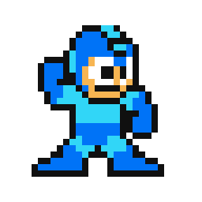

<h1 align="center">
  Hey everyone!<br>
  <p>It's me Ranit, Software Engineer Intern at </p>
  
</h1>

```
  👨🏻‍🎓 CS graduate from SCOE, Pune
  🚀 Holds key interest in Backend Development & Databases
  🛠️ Main Languages: C++, Python
  🧑🏻‍💻 Currently I'm learning and tinkering with Rust🦀
  📧 Drop me a mail at (ranitbiswas.cs@gmail.com)
```

<br>

<h2>👀 GitHub Stats</h2>
<a href="https://github.com/RhoNit" align="left"></a>
<a href="https://github.com/RhoNit" align="right"></a>

